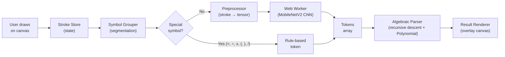
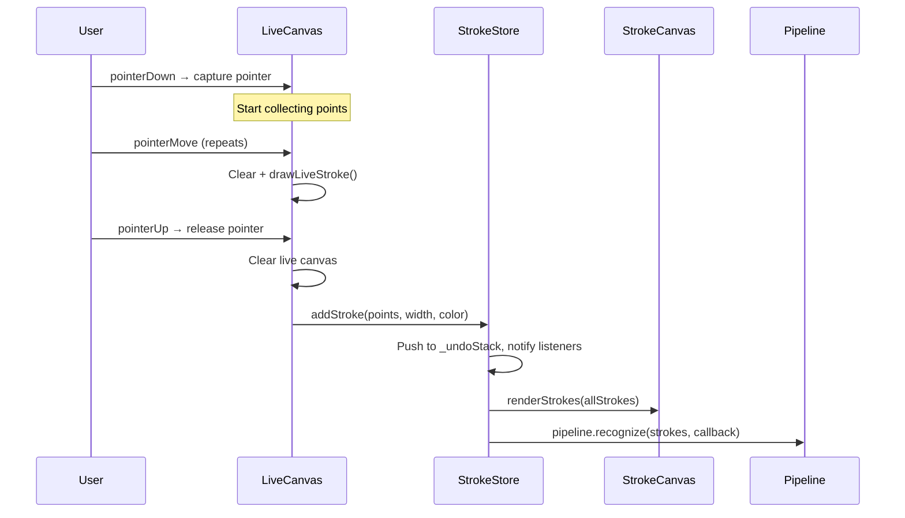
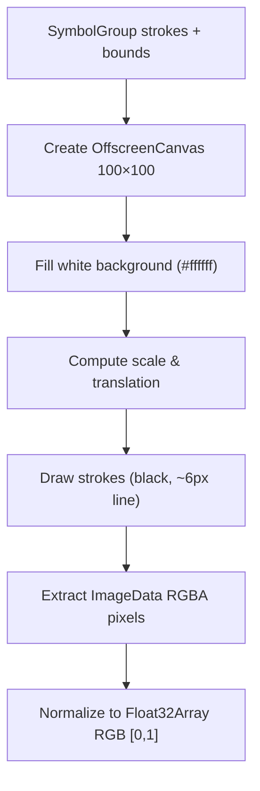
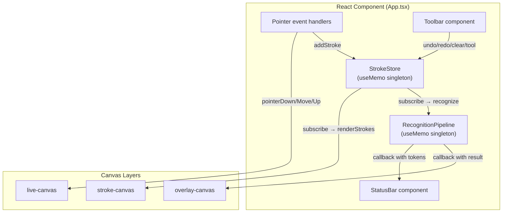
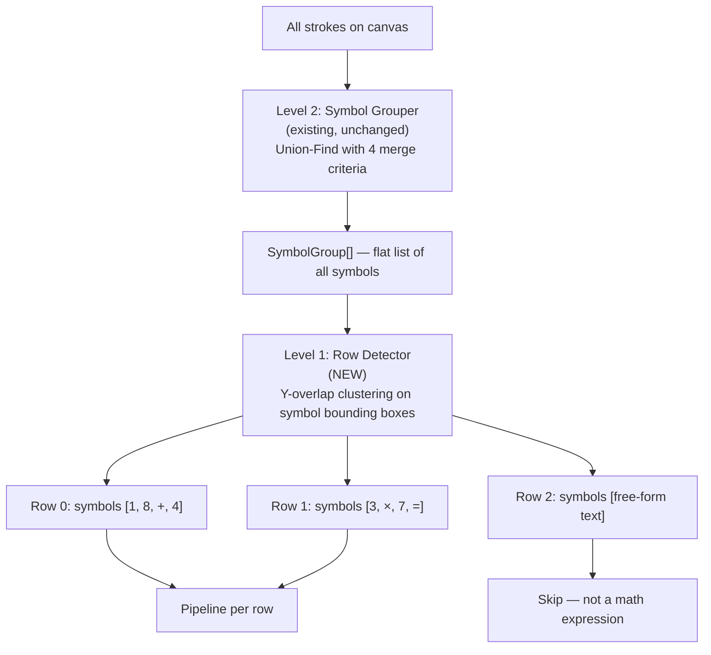
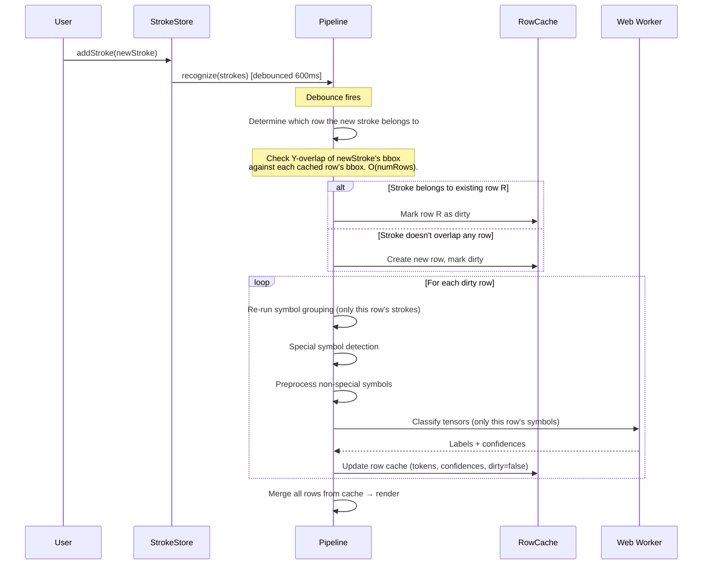

# CalcInk — Complete System Architecture

> A detailed technical reference for every subsystem in CalcInk: how strokes become pixels, how pixels become symbols, and how symbols become answers.

---

## Table of Contents

1. [High-Level System Overview](#1-high-level-system-overview)
2. [Canvas & Stroke Management](#2-canvas--stroke-management)
   - 2.1 [Stroke Data Model](#21-stroke-data-model)
   - 2.2 [Stroke Store (State Management)](#22-stroke-store-state-management)
   - 2.3 [Canvas Renderer](#23-canvas-renderer)
   - 2.4 [Multi-Layer Canvas Architecture](#24-multi-layer-canvas-architecture)
   - 2.5 [Input Handling & Pointer Events](#25-input-handling--pointer-events)
3. [Recognition Pipeline — Full End-to-End Flow](#3-recognition-pipeline--full-end-to-end-flow)
   - 3.1 [Pipeline Orchestration](#31-pipeline-orchestration)
   - 3.2 [Step 1 — Stroke Grouping (Symbol Segmentation)](#32-step-1--stroke-grouping-symbol-segmentation)
   - 3.3 [Step 2 — Special Symbol Detection (Rule-Based Bypass)](#33-step-2--special-symbol-detection-rule-based-bypass)
   - 3.4 [Step 3 — Image Preprocessing (Stroke → Tensor)](#34-step-3--image-preprocessing-stroke--tensor)
   - 3.5 [Step 4 — Neural Network Inference (Worker Thread)](#35-step-4--neural-network-inference-worker-thread)
4. [Model Architecture](#4-model-architecture)
5. [Math Parsing & Evaluation](#5-math-parsing--evaluation)
   - 5.1 [Tokenizer](#51-tokenizer)
   - 5.2 [Recursive-Descent Parser](#52-recursive-descent-parser)
   - 5.3 [Operator Precedence & Grammar](#53-operator-precedence--grammar)
6. [Result Rendering](#6-result-rendering)
7. [Application Wiring (App.tsx)](#7-application-wiring-apptsx)
8. [Build & Runtime Stack](#8-build--runtime-stack)
9. [Design Trade-offs & Rationale](#9-design-trade-offs--rationale)
10. [File Map](#10-file-map)
11. [Multi-Expression Notes Mode (Planned Evolution)](#11-multi-expression-notes-mode-planned-evolution)
    - 11.1 [Two-Level Grouping Strategy](#111-two-level-grouping-strategy)
    - 11.2 [Row Detection Algorithm](#112-row-detection-algorithm)
    - 11.3 [Dirty-Region Optimization (Incremental Recognition)](#113-dirty-region-optimization-incremental-recognition)
    - 11.4 [Expression vs Free-Form Detection](#114-expression-vs-free-form-detection)
    - 11.5 [Canvas Changes for Notes Mode](#115-canvas-changes-for-notes-mode)
    - 11.6 [Multi-Expression Trade-offs](#116-multi-expression-trade-offs)

---

## 1. High-Level System Overview

CalcInk is a browser-based handwritten math calculator. The user draws arithmetic expressions on an HTML canvas with a stylus or mouse, and the app recognizes every symbol, evaluates each expression, and renders answers inline — all in real time, entirely client-side, with zero server calls.

**Current mode**: Single expression — all strokes are treated as one flat expression.
**Planned evolution**: Multi-expression notes mode — canvas acts like a notebook where multiple expressions can coexist, and only rows ending with `=` are evaluated (see [Section 11](#11-multi-expression-notes-mode-planned-evolution)).



**Key architectural properties:**
- **100% offline** — models ship as static assets, no API calls
- **60 FPS rendering** — inference is off-loaded to a Web Worker
- **Debounced recognition** — waits 600 ms after the last stroke before running the pipeline
- **Planned: incremental recognition** — only re-process the row that changed, not the entire canvas

---

## 2. Canvas & Stroke Management

### 2.1 Stroke Data Model

> Source: [`strokeModel.ts`](file:///f:/Coding/projects/bootcamp%20fully%20AI/src/canvas/strokeModel.ts)

The fundamental data unit is a **Stroke** — a polyline defined by a sequence of `Point`s:

```typescript
interface Point {
  x: number;        // CSS pixels from canvas left
  y: number;        // CSS pixels from canvas top
  pressure: number; // PointerEvent.pressure (0.0–1.0, defaults 0.5)
  timestamp: number;// Date.now() — used for temporal grouping heuristics
}

interface Stroke {
  id: string;       // Unique ID: "s_{timestamp}_{counter}"
  points: Point[];
  width: number;    // Line width in CSS px (user-adjustable, 1–8)
  color: string;    // Currently fixed to '#1a1a2e' (dark ink)
}
```

**Bounding box helpers** are also defined here:
- [`getStrokeBounds(stroke)`](file:///f:/Coding/projects/bootcamp%20fully%20AI/src/canvas/strokeModel.ts#L25-L35) — computes `{x, y, width, height}` from min/max of all points in a single stroke.
- [`getGroupBounds(strokes[])`](file:///f:/Coding/projects/bootcamp%20fully%20AI/src/canvas/strokeModel.ts#L37-L50) — computes the enclosing bounding box of multiple strokes. Used by the symbol grouper to define each symbol's spatial extent.
- [`generateStrokeId()`](file:///f:/Coding/projects/bootcamp%20fully%20AI/src/canvas/strokeModel.ts#L52-L55) — monotonically increasing IDs to guarantee uniqueness.

**Trade-off:** Pressure data is captured but not currently used for variable stroke width rendering. It is stored for future use (e.g. pressure-sensitive brush, or as an input feature to a more advanced model). The cost is 8 extra bytes per point — negligible.

---

### 2.2 Stroke Store (State Management)

> Source: [`strokeStore.ts`](file:///f:/Coding/projects/bootcamp%20fully%20AI/src/canvas/strokeStore.ts)

The `StrokeStore` class is a **custom, framework-agnostic reactive store** that manages the list of committed strokes and a full undo/redo history.

| Feature | Implementation |
|---|---|
| **Data structure** | `Stroke[]` array, append-only until undo/redo |
| **Undo/Redo** | Two stacks (`_undoStack`, `_redoStack`) capped at 100 entries |
| **Reactivity** | Pub-sub via `subscribe(listener)` → `Set<() => void>` |
| **Actions** | `addStroke`, `removeStrokes`, `clear`, `undo`, `redo` |
| **Eraser: stroke mode** | `getStrokeAt(x, y, radius)` — iterates strokes in reverse (topmost first), checks point proximity with Euclidean distance |
| **Eraser: pixel mode** | `eraseAt(x, y, radius)` — filters points from all strokes, splits/removes strokes as needed |

**Undo action types:**
```typescript
type StrokeAction =
  | { type: 'add'; stroke: Stroke }          // Undo = remove this stroke
  | { type: 'remove'; strokeIds: string[] }  // Undo = re-add removed strokes
  | { type: 'clear'; strokes: Stroke[] };    // Undo = restore all cleared strokes
```

**Trade-off: Why not Redux/Zustand?**
A custom store was chosen over React state management libraries because:
1. The store is consumed by both React components AND non-React systems (the recognition pipeline, the canvas renderer).
2. It avoids coupling state management to the React render cycle — strokes can be committed and rendered at 60 FPS without triggering React re-renders on every point.
3. The pub-sub model (`_listeners`) lets the canvas renderer and the recognition pipeline subscribe independently.

**Trade-off: Pixel eraser stores full snapshot.**
The pixel eraser (`eraseAt`) reconstructs the entire stroke array and pushes a `'clear'` action to the undo stack (saving a full copy of the old strokes). This is memory-expensive for large canvases but guarantees perfect undo fidelity without needing to track individual point deletions.

---

### 2.3 Canvas Renderer

> Source: [`renderer.ts`](file:///f:/Coding/projects/bootcamp%20fully%20AI/src/canvas/renderer.ts)

The renderer is a pure-function module with zero internal state. It draws strokes onto a `CanvasRenderingContext2D` using **midpoint-quadratic Bézier smoothing**.

**Smoothing algorithm:**
```
For each consecutive triple of points (P[i-1], P[i], P[i+1]):
  midpoint = ((P[i].x + P[i+1].x) / 2, (P[i].y + P[i+1].y) / 2)
  ctx.quadraticCurveTo(P[i].x, P[i].y, midpoint.x, midpoint.y)
```

This produces smooth, natural-looking curves from discrete pointer samples. The control point is the actual sample position, and the endpoint is the midpoint between two consecutive samples.

**DPR (Device Pixel Ratio) handling:**
[`setupCanvas(canvas, container)`](file:///f:/Coding/projects/bootcamp%20fully%20AI/src/canvas/renderer.ts#L7-L20) scales the canvas internal dimensions by `window.devicePixelRatio`, then applies an inverse CSS size, and calls `ctx.scale(dpr, dpr)`. This ensures crisp rendering on HiDPI/Retina displays without requiring coordinate transforms elsewhere.

**Key functions:**
| Function | Purpose |
|---|---|
| `setupCanvas` | Set canvas dimensions + DPR scaling |
| `clearCanvas` | Full `clearRect` |
| `drawStroke` | Draw a single stroke with quadratic smoothing |
| `renderStrokes` | Clear + redraw all committed strokes |
| `drawLiveStroke` | Draw the in-progress stroke (on the live layer) |
| `eventToCanvasCoords` | Convert `PointerEvent` client coords to canvas-local coords (handles `getBoundingClientRect` offset) |

**Trade-off: Full redraw on every change.**
`renderStrokes` clears and redraws ALL strokes from scratch on every store change. This is O(n × m) where n = strokes, m = average points per stroke. For typical handwritten expressions (< 200 strokes, < 50 points each), this completes in < 1 ms and is simpler than maintaining dirty rectangles or an incremental renderer.

---

### 2.4 Multi-Layer Canvas Architecture

> Source: [`App.tsx`](file:///f:/Coding/projects/bootcamp%20fully%20AI/src/App.tsx#L278-L316)

CalcInk uses **three stacked `<canvas>` elements** inside a positioned container, each serving a distinct purpose:

```
┌─────────────────────────────────────────────────┐
│  .canvas-container (position: relative)         │
│                                                 │
│  ┌─── z-index: 3 ─── overlay-canvas ──────────┐ │
│  │  Result text, confidence dots               │ │
│  │  pointer-events: none (click-through)       │ │
│  ├─── z-index: 2 ─── live-canvas ─────────────┤ │
│  │  Currently-drawing stroke                   │ │
│  │  Receives all pointer events                │ │
│  ├─── z-index: 1 ─── stroke-canvas ───────────┤ │
│  │  All committed (finalized) strokes          │ │
│  └─────────────────────────────────────────────┘ │
│  .canvas-paper-bg (decorative grid background)   │
└─────────────────────────────────────────────────┘
```

| Layer | z-index | Pointer events | Content |
|---|---|---|---|
| `stroke-canvas` | 1 | none | Committed strokes (full redraw from StrokeStore) |
| `live-canvas` | 2 | **active** | In-progress stroke being drawn; cleared on pointerUp |
| `overlay-canvas` | 3 | none | Computed result text + per-symbol confidence dots |

**Why three canvases instead of one?**
1. **Live stroke isolation**: Drawing the current stroke requires clearing and redrawing on every `pointerMove`. If the live stroke shared a canvas with committed strokes, we'd need to redraw ALL strokes on every mouse movement (60+ times/sec). With a separate live layer, we only redraw the single in-progress stroke.
2. **Overlay isolation**: The result text and confidence indicators must be visually on top of the ink but must NOT intercept pointer events. Using a separate canvas with `pointer-events: none` achieves this cleanly.
3. **Independent clear cycles**: The overlay can be cleared without affecting the strokes, and vice versa.

---

### 2.5 Input Handling & Pointer Events

> Source: [`App.tsx`](file:///f:/Coding/projects/bootcamp%20fully%20AI/src/App.tsx#L142-L219)

The app uses the **Pointer Events API** (`onPointerDown`, `onPointerMove`, `onPointerUp`, `onPointerLeave`) for unified mouse + touch + stylus input.

**Drawing flow (`tool === 'pen'`):**



**Eraser flow (`tool === 'strokeEraser'`):**
On each `pointerDown` and `pointerMove`, calls `store.getStrokeAt(x, y, 15)` to find the topmost stroke within 15px radius, then `store.removeStrokes([hit.id])`.

**Eraser flow (`tool === 'pixelEraser'`):**
On each `pointerDown` and `pointerMove`, calls `store.eraseAt(x, y, 15)` which filters individual points from all strokes within a 15px radius.

**`setPointerCapture`:** Used to ensure pointer events continue to fire even if the cursor moves outside the canvas boundary during a drag. Released on `pointerUp`.

---

## 3. Recognition Pipeline — Full End-to-End Flow

### 3.1 Pipeline Orchestration

> Source: [`pipeline.ts`](file:///f:/Coding/projects/bootcamp%20fully%20AI/src/recognition/pipeline.ts)

The `RecognitionPipeline` class orchestrates the entire recognition process:

```
Strokes → Group → [Special? → Rule token] / [Preprocess → Worker → CNN token] → Tokens[]
```

**Lifecycle:**
1. **Debouncing**: `recognize()` waits 600 ms after the last call before executing. Every new stroke resets the timer. This prevents running expensive inference while the user is still actively drawing.
2. **Cancellation**: If a new recognition request arrives while a previous one is in-flight in the Worker, the old callback is discarded (`pendingCallbacks.delete(oldId)`). The Worker may still be computing, but its result will be ignored.
3. **Immediate mode**: `recognizeImmediate()` bypasses the debounce timer. Currently unused but available for future "recognize now" button.

**Data flow in `_runRecognition()`:**

```
1. groupStrokesIntoSymbols(strokes) → SymbolGroup[]
2. For each group:
   a. detectSpecialSymbol(group) → if match, fill token directly
   b. else: preprocessSymbol(group.strokes, group.bounds, 100, 3) → Float32Array[30000]
3. Send all pending (non-special) tensors to Worker via postMessage
4. Worker returns labels[] + confidences[] for the pending symbols
5. Merge rule-based + model-based tokens into final token array
6. Call callback with { tokens, confidences, groups }
```

**Zero-copy transfer**: Tensors are transferred to the Worker using the `Transferable` mechanism (`postMessage(msg, [buffer1, buffer2, ...])`) which moves the `ArrayBuffer` ownership to the Worker without copying the data. This is critical because each tensor is 30,000 floats = 120 KB.

**Trade-off: Debounce value (600 ms).**
- Too short → pipeline fires on incomplete symbols (e.g. fires after the first stroke of a two-stroke `=`).
- Too long → feels laggy to the user.
- 600 ms was empirically chosen as a good balance for typical writing speed.

---

### 3.2 Step 1 — Stroke Grouping (Symbol Segmentation)

> Source: [`symbolGrouper.ts`](file:///f:/Coding/projects/bootcamp%20fully%20AI/src/recognition/symbolGrouper.ts)

This is the **most critical pre-model step**. It decides which strokes belong to the same symbol. A wrong grouping means the model receives incorrect input regardless of how accurate it is.

**Algorithm: Union-Find with multi-criteria merging**

```
1. Compute bounding box for each stroke
2. Sort strokes left-to-right by bounding box x
3. Initialize Union-Find with each stroke as its own group
4. For each pair (i, j) where i < j:
     if shouldGroupStrokes(i, j) → union(i, j)
5. Collect groups by root, compute merged bounding box
6. Sort groups left-to-right by centroid x-coordinate
```

**Merging criteria in `shouldGroupStrokes()`:**

The function applies **four heuristic tests** in order (short-circuit on first match):

| # | Test | What it catches | Condition |
|---|---|---|---|
| 1 | **Segment intersection** | `+`, `×`, `4` (crossed strokes) | Any segment of stroke A intersects any segment of stroke B |
| 2 | **Physical touch** | Strokes that share endpoints | Min point-to-point distance ≤ `min(gapThreshold, 10)` px |
| 3 | **Vertical stacking** | `=` sign, `÷` dots, `5` hat | Horizontal overlap > 35% of narrower stroke's width AND vertical gap ≤ max(25px, 2.5× taller stroke's height) |
| 4 | **2D containment** | Dots inside letters, small marks | Horizontal overlap > 60% of narrower width AND vertical overlap > 60% of shorter height |

**Quick reject**: Before running any test, bounding boxes are checked with a `maxGap` margin. If boxes are further than `maxGap` pixels apart on any axis, the pair is skipped.

**Segment intersection detection** uses the standard CCW (counter-clockwise) orientation test:
```
segments P1-P2 and P3-P4 intersect iff:
  ccw(P1,P3,P4) ≠ ccw(P2,P3,P4) AND ccw(P1,P2,P3) ≠ ccw(P1,P2,P4)
```

**Minimum distance** is computed by brute-force O(m×n) over all point pairs. This is acceptable because individual strokes rarely have more than ~50 points.

**Trade-off: O(n²) pairwise comparison.**
All stroke pairs are compared. For a typical expression with 10–30 strokes, this means 45–435 pair checks — fast enough (< 1 ms). For much larger inputs, a spatial index (R-tree, grid hash) would be needed. In multi-expression notes mode (see [Section 11](#11-multi-expression-notes-mode-planned-evolution)), `n` is kept small by running O(n²) grouping **per row** instead of on the whole canvas.

**Trade-off: `gapThreshold = 30px` default.**
This is a fixed value that works well for medium-sized handwriting. Very small writing (< 15px per symbol) may cause under-grouping; very large writing may cause over-grouping. An adaptive threshold based on average stroke size would improve robustness.

**Trade-off: Vertical stacking allows 2.5× height gap.**
This is generous enough to capture `=` signs drawn with wide spacing, and `÷` with dots far from the bar. But it can over-group vertically stacked independent expressions (e.g. `3 + 2` written above `1 - 4`). CalcInk currently assumes a single horizontal expression. The planned multi-expression mode (Section 11) solves this by running row detection **after** symbol grouping, so `=` and `÷` are already merged before row separation is attempted.

---

### 3.3 Step 2 — Special Symbol Detection (Rule-Based Bypass)

> Source: [`specialSymbols.ts`](file:///D:/CodePlayground/Projects/bootcamp/CalcInk/src/recognition/specialSymbols.ts)

Before sending any symbol to the neural network, each `SymbolGroup` is tested against **geometric rules**. If a rule matches, the token is emitted directly (confidence: 0.92–0.99) and the group is never sent to the model. This is the primary defence against CNN misclassification for symbols the model handles poorly.

#### Two-stroke symbols

| Symbol | Detection rule |
|---|---|
| **`x`** | Exactly 2 strokes. One has a **`\` diagonal** direction (`dx·dy > 0`), the other a **`/` diagonal** (`dx·dy < 0`). Their bounding boxes must overlap by ≥ 20% of the smaller stroke's minimum dimension in both axes — i.e. they cross each other. Checked **before** `=` so crossing diagonals are never misread as equals. |
| **`=`** | Exactly 2 strokes, both **horizontal** (width ≥ 6px, width > 0.9× height), vertically separated (gap ≥ 2px), horizontally overlapping (> 25% of narrower width), similar widths (ratio > 0.30). |

#### Three-stroke symbols

| Symbol | Detection rule |
|---|---|
| **`÷`** | Exactly 3 strokes. Widest stroke is a horizontal bar (width ≥ 10px, > 1.3× height). Other two are small (< 70% of bar dimension). One centroid above bar midline, one below. |

#### Single-stroke symbols

| Symbol | Detection rule |
|---|---|
| **`.`** | Bounding box ≤ 15×15 px AND ≤ 10 points. |
| **`/` → `÷`** | Height > 1.5× width. Chord direction is `/` (top-right to bottom-left: `dx·dy < 0`). Max deviation from the chord < 12% of chord length, average < 6%. Emits `÷`. |
| **`(`** | Height > 1.5× width. Chord is mostly **vertical** (horizontal-to-vertical ratio < 0.5). All points bow to the **left** of the chord (> 80% of points). Max sagitta > 8% of chord length. Minimum sagitta in the middle 50% of the stroke is > 40% of max sagitta (rejects `3`, `E`, `B` which dip back to the chord in the middle). |
| **`)`** | Same as `(` but all points bow to the **right**. |

**`diagonalSign()` helper:**
A private utility function returns `+1` for a `\`-diagonal stroke (start→end has `dx·dy > 0`), `-1` for `/`-diagonal, and `0` for strokes that are too horizontal, too vertical, or too short (< 5px in either axis) to classify.

**Why `x` before `=`:**
Both are 2-stroke symbols. The `x` check runs first. If both strokes are diagonal and crossing, it returns `x` immediately. Only if that fails does the `=` check run (which requires both strokes to be horizontal).

**Middle-twist rejection for brackets:**
A `3`, `E`, or `B` drawn vertically also looks like a right-bowing arc until you inspect its interior. For brackets, we project all points onto the start→end chord and find the **minimum** sagitta (outward distance from chord) among all points in the middle 50% of the chord length. For a true bracket this stays high; for a `3` the middle of the stroke curls back inward, making this minimum collapse to ~0. The test `minMiddleSagitta > maxSagitta * 0.4` efficiently rejects those cases.

**Why rule-based for these symbols?**

1. **`=`** is unreliable in the CNN (ambiguous training labels).
2. **`÷`** has a unique 3-stroke structure that is trivially geometric.
3. **`.`** is too small for the 100×100 CNN input to be meaningful.
4. **`(`, `)`** are entirely absent from the CNN's 19-class output — rule-based is the only option.
5. **`x`** is the primary variable letter. The CNN maps its `X` class to `x`, but accuracy is poor (often confused with `3`). Geometric detection of crossing diagonals is far more reliable.
6. **`/`** (slash-as-division) is absent from the CNN vocabulary; single-stroke detection fills the gap.

---


### 3.4 Step 3 — Image Preprocessing (Stroke → Tensor)

> Source: [`preprocess.ts`](file:///f:/Coding/projects/bootcamp%20fully%20AI/src/recognition/preprocess.ts)

For each symbol group that was NOT resolved by the rule-based detector, the strokes must be rendered into a normalized image tensor suitable for the neural network.

**Target format (for MobileNetV2 / Sagyam model):**
- **Size**: 100 × 100 pixels
- **Channels**: 3 (RGB)
- **Values**: `[0.0, 1.0]` per channel — black ink on white background
- **Total tensor**: `Float32Array(30000)`

**Preprocessing pipeline:**



**Detailed steps:**

1. **Canvas creation**: Uses `OffscreenCanvas(100, 100)` in the Web Worker (no DOM needed). Falls back to `document.createElement('canvas')` on main thread, or a pure-JS rasterizer in headless test environments.

2. **Coordinate transform**: 
   - Content box: 20% padding on all sides → effective content area is 80×80 pixels within the 100×100 canvas.
   - Scale factor: `contentSize / max(bounds.width, bounds.height)` — aspect ratio is preserved, the symbol is scaled to fit the content box.
   - Translation: Symbol centroid is mapped to canvas center `(50, 50)`.

   ```
   toTargetX(x) = 50 + (x - centerX) * scale
   toTargetY(y) = 50 + (y - centerY) * scale
   ```

3. **Stroke rendering**: 
   - Color: `#000000` (pure black)
   - Line width: `max(4.0, targetSize × 0.06)` = 6px at 100px target. This ensures the stroke is thick enough to be clearly visible at the small resolution.
   - Line smoothing: Same midpoint-quadratic algorithm as the display renderer.
   - Cap/join: `round` for natural pen appearance.

4. **Pixel extraction**: `ctx.getImageData(0, 0, 100, 100)` → `Uint8ClampedArray` of RGBA values.

5. **Normalization**: For 3-channel output, each pixel's R, G, B values are divided by 255.0 to produce `[0.0, 1.0]` floats. Alpha is ignored (canvas has opaque white background).

**For the fallback MLP (28×28 grayscale):**
The same function supports `targetSize=28, channels=1`:
- 8px padding → 20×20 content area (matching MNIST convention)
- 3.2px stroke width
- Grayscale conversion: `gray = (R + G + B) / 3`, then invert: `tensor[i] = 1.0 - gray / 255.0`
- **Center-of-mass centering**: After rasterization, the tensor is shifted so the "center of pixel mass" (weighted centroid of non-zero pixels) aligns with the tensor center `(13.5, 13.5)`. This matches the MNIST preprocessing convention and is critical for the MLP's accuracy.

**Pure-JS fallback rasterizer** ([`rasterizeStrokesDirectly`](file:///f:/Coding/projects/bootcamp%20fully%20AI/src/recognition/preprocess.ts#L138-L183)):
For headless test environments without Canvas API support, strokes are rasterized by plotting each point with a 3×3 kernel. This produces a rougher image but is sufficient for unit testing.

**Trade-off: 100×100 vs 28×28.**
The Sagyam MobileNetV2 model expects 100×100×3 RGB input. The Irfan MLP expects 28×28×1 grayscale. The preprocessor dynamically selects the format based on the `targetSize` and `channels` parameters. 100×100 preserves more detail (especially for complex symbols like ÷ or multi-stroke characters) but requires ~44× more computation per inference.

**Trade-off: Fixed stroke width.**
The preprocessing renders all strokes at a fixed width (6px at 100×100, 3.2px at 28×28) regardless of the user's actual stroke width setting. This normalizes the input for the model, which was trained on roughly uniform stroke widths. If the user draws extremely thin lines (width=1), the original canvas will look fine, but the preprocessed image will have thicker strokes. This is intentional — the model was not trained on hairline strokes.

**Trade-off: 20% padding.**
The padding ensures the symbol doesn't touch the edges of the tensor, which would cause edge artifacts in convolution layers. 20% was empirically chosen to match the Sagyam model's training data distribution.

---

### 3.5 Step 4 — Neural Network Inference (Worker Thread)

> Source: [`recognitionWorker.ts`](file:///f:/Coding/projects/bootcamp%20fully%20AI/src/workers/recognitionWorker.ts)

Inference runs in a **dedicated Web Worker** to avoid blocking the main thread (canvas rendering must maintain 60 FPS).

**Worker initialization (`initModel()`):**

The Worker loads the MobileNetV2 model on first use (lazy initialization via `initPromise` singleton). This means the first recognition request incurs a ~1–3 second load delay, but subsequent requests are instant.

**Message protocol:**

```
Main → Worker:  { type: 'classify', id: number, tensors: Float32Array[], batchSize: number }
Worker → Main:  { type: 'result', id: number, labels: string[], confidences: number[] }
Worker → Main:  { type: 'error', id: number, message: string }
```

**Inference (per tensor):**

Uses TensorFlow.js with MobileNetV2 (`tf.tensor4d → model.predict → argmax`).

**Custom Keras serialization:**
The Sagyam model uses `L1` and `L2` regularizers that are exported as custom class names. The Worker registers dummy serialization handlers:
```typescript
class L2 { static className = 'L2'; constructor(config) { return tf.regularizers.l1l2(config); } }
class L1 { static className = 'L1'; constructor(config) { return tf.regularizers.l1l2(config); } }
tf.serialization.registerClass(L2);
tf.serialization.registerClass(L1);
```
Without this, `tf.loadLayersModel` would throw "Unknown regularizer: L2".

---

## 4. Model Architecture

> Source: [Sagyam/Handwritten-Optical-Character-Recognition](https://github.com/Sagyam/Handwritten-Optical-Character-Recognition)
> Files: [`/models/sagyam/model.json`](file:///f:/Coding/projects/bootcamp%20fully%20AI/public/models/sagyam/model.json) + 4 weight shards (~14.4 MB total)

| Property | Value |
|---|---|
| **Architecture** | MobileNetV2 (transfer learning from ImageNet) |
| **Input** | `[batch, 100, 100, 3]` float32 (RGB, normalized 0–1) |
| **Output** | `[batch, 19]` float32 (softmax probabilities) |
| **Total parameters** | ~2.3M (mostly from MobileNetV2 backbone) |
| **Weight size** | 14.4 MB (4 shards) |
| **Framework** | Keras v2.6.0, converted via TensorFlow.js Converter v3.12.0 |
| **Activation** | ReLU6 (capped at 6.0), Softmax output |

**19 output classes:**

| Index | Class name | Mapped token |
|---|---|---|
| 0–9 | `0` – `9` | `0` – `9` |
| 10 | `Add` | `+` |
| 11 | `Decimal` | `.` |
| 12 | `Division` | `÷` |
| 13 | `Equals` | `=` |
| 14 | `Multiply` | `×` |
| 15 | `Minus` | `-` |
| 16 | `X` | `x` *(variable)* |
| 17 | `Y` | `y` |
| 18 | `Z` | `z` |

> [!NOTE]
> `X` (index 16) was previously mapped to `×` (multiplication). It is now mapped to the lowercase variable letter `x`. In practice, the geometric `x` detector in `specialSymbols.ts` intercepts correctly drawn `x` symbols before they even reach the CNN, so the CNN path is a fallback for ambiguous cases.

**MobileNetV2 backbone structure** (simplified):
```
Input(100,100,3)
  → Conv2D(32, 3×3, stride=2) + BN + ReLU6
  → 17 Inverted Residual Blocks (DepthwiseConv + Pointwise Conv + Skip connections)
  → Conv2D(1280, 1×1) + BN + ReLU6
  → GlobalAveragePooling2D
  → Dense(128) with L2 regularization
  → Dropout(0.3)
  → Dense(19, softmax)
```

Each **Inverted Residual Block** follows the pattern:
1. **Expand**: 1×1 Conv (increase channels by expansion factor 6×)
2. **Depthwise**: 3×3 DepthwiseConv (spatial filtering, channel-independent)
3. **Project**: 1×1 Conv (reduce channels back)
4. **Residual skip**: Add input to output (only when input/output shapes match)

**Trade-off: Model size (14.4 MB).**
This is large for a web app. On a 10 Mbps connection, the model takes ~11 seconds to download. Mitigations:
- **Service Worker caching** (via Vite PWA plugin) — model is cached after first load
- **Lazy loading** — model loads only when the first recognition request is made, not on page load
- **Offline bundling** — shipped locally with zero third-party network fetches

**Trade-off: MobileNetV2 vs simpler CNN.**
MobileNetV2 is ~2.3M params for a 19-class problem that could theoretically be solved with a ~100K param custom CNN. However:
1. It uses transfer learning from ImageNet — features learned from millions of natural images transfer surprisingly well to handwriting
2. The Sagyam repo reported high accuracy on their test set (>94%)
3. Depthwise separable convolutions make MobileNetV2 faster at inference than a naive CNN with similar accuracy

---

### 4.1 Model Selection Justification & Candidate Evaluation

When evaluating candidate recognition models for CalcInk, the selection was constrained by four mandatory criteria:
1. **High Accuracy (> 94%)**: Essential for low user frustration during handwriting recognition.
2. **Multi-Class Output**: Must recognize digits `0–9`, arithmetic operators, and algebraic variables in one pass.
3. **Open-Source Licensing**: Must have a clear, compliant open-source license.
4. **Browser Runtime Suitability**: Must run client-side in a Web Worker (TensorFlow.js / WebGL) without requiring heavy Python/PyTorch backends.

#### Candidates Evaluated:

| Candidate Repository | License | Accuracy / Scope | Browser Suitability | Verdict |
|---|---|---|---|---|
| **[Sagyam/Handwritten-Optical-Character-Recognition](https://github.com/Sagyam/Handwritten-Optical-Character-Recognition)** | **GPL-3.0** ✅ | **> 94% accuracy**, 19 classes (digits, operators, x/y/z variables) | Native TensorFlow.js export (`model.json` + shards); runs off-thread in WebGL Worker | **Selected ✅** |
| **[fisherman611/handwritten-mathematical-expression-recognition](https://github.com/fisherman611/handwritten-mathematical-expression-recognition)** (CAN) | **MIT** ✅ | High accuracy end-to-end LaTeX sequence parser (Counting-Aware Network) | PyTorch / GPU checkpoint (> 100MB+); extremely heavy to port and execute in browser client | **Rejected ❌** (Too heavy for browser runtime) |
| **[Roodaki/Math-Vision](https://github.com/Roodaki/Math-Vision)** | **MIT** ✅ | YOLO-based full-image equation detection | Heavy multi-stage pipeline; slow inference latency for real-time 60 FPS drawing | **Rejected ❌** (High latency & large footprint) |
| **[antoineabf/handwritten_math_symbols_neural_network](https://github.com/antoineabf/handwritten_math_symbols_neural_network)** | **No License** ❌ | Basic math symbol CNN | Lacks legal distribution rights (exclusive author copyright) | **Rejected ❌** (Unusable due to licensing) |

#### Rationale for Selection:
Sagyam's MobileNetV2 model was the **only candidate** that combined:
- **Verified > 94% accuracy** on varied handwriting styles.
- **Full 19-class coverage** spanning digits `0–9`, operators, decimal, and variables (`x`, `y`, `z`).
- **Legal compliance** under GPL-3.0 open-source licensing.
- **Turnkey TensorFlow.js compatibility**, allowing execution entirely in-browser inside a Web Worker with $< 20$ ms inference times.

---

## 5. Math Parsing & Evaluation

> Source: [`parser/index.ts`](file:///D:/CodePlayground/Projects/bootcamp/CalcInk/src/parser/index.ts)

The parser has been upgraded from a simple scalar evaluator to a **full algebraic evaluator** that supports single-variable expressions, implicit multiplication, and linear/quadratic equation solving.

### 5.1 Tokenizer

The tokenizer converts a string of recognised characters into a stream of typed tokens:

```typescript
type TokenKind = 'NUMBER' | 'VAR' | 'PLUS' | 'MINUS' | 'MUL' | 'DIV'
               | 'LPAREN' | 'RPAREN' | 'EQUALS' | 'EOF';
```

**Character normalization** happens first:

| Input | Normalized to |
|---|---|
| `×`, `*` | `*` |
| `÷`, `/` | `/` |
| `−` (em-dash), `–` (en-dash) | `-` |
| any letter `a`–`z`, `A`–`Z` | `VAR` token (lowercased) |

**Multi-digit number assembly**: Consecutive digits and at most one `.` are coalesced into a single `NUMBER` token. `['1','8']` → `NUMBER(18)`.

**Implicit multiplication injection**: After tokenizing, a `MUL` token is automatically inserted between adjacent tokens where multiplication is implied:

| Left token | Right token | Example |
|---|---|---|
| `NUMBER` | `VAR` | `2x` → `2 × x` |
| `NUMBER` | `LPAREN` | `2(x+3)` → `2 × (x+3)` |
| `RPAREN` | `VAR` | `(x+1)x` → `(x+1) × x` |
| `RPAREN` | `LPAREN` | `(a)(b)` → `(a) × (b)` |
| `RPAREN` | `NUMBER` | `(x+1)2` → `(x+1) × 2` |
| `VAR` | `LPAREN` | `x(x+1)` → `x × (x+1)` |

### 5.2 Polynomial Algebra

Instead of evaluating to a plain `number`, sub-expressions evaluate to a **`Polynomial`** — an array of coefficients:

```
Polynomial([c0, c1, c2, ...]) = c0 + c1·x + c2·x² + ...
```

| Expression | Polynomial |
|---|---|
| `4` | `[4]` |
| `x` | `[0, 1]` |
| `2x + 4` | `[4, 2]` |
| `x² - x` | `[0, -1, 1]` |

The `Polynomial` class supports `add`, `sub`, `mul`, `div` (division by constant only). This allows the parser to carry variable expressions symbolically through the full BODMAS tree.

### 5.3 Two-Mode Evaluation

The public `evaluate(input, env)` function **auto-detects** which mode applies by inspecting the token stream:

#### Mode 1 — Equation Solve (LHS = RHS)

**Trigger**: An `=` token exists in the token list AND there are non-equals tokens after it (i.e. both sides are non-empty).

**Examples**: `2x+4=10`, `3x-2=x+6`, `x(x-1)=6`

**Behaviour**:
1. Parse the full expression as a polynomial equation: `LHS − RHS = 0`
2. Solve for the single variable:
   - **Linear** (`c0 + c1·x = 0`): `x = −c0 / c1`
   - **Quadratic** (`c0 + c1·x + c2·x² = 0`): quadratic formula, returns the larger root
3. **Store** the solved value in `env[varName]` for use by subsequent rows
4. Return the solved value as the answer

#### Mode 2 — Expression Evaluate (trailing `=` or no `=`)

**Trigger**: No `=` token, or `=` is the last meaningful token.

**Examples**: `2x+5=` (x was solved on a previous row), `3+4=`, `18+4×3=`

**Behaviour**:
1. If the expression contains a variable, look it up in `env`. If not found, return `{ ok: false, error: "Variable 'x' is not defined" }`.
2. Substitute the stored value into the polynomial and evaluate to a scalar.
3. Return the numeric result.

```
Row 1: "2x+4=10"  → Mode 1 → solves x=3, stores env.x=3, displays "3"
Row 2: "2x+5="    → Mode 2 → substitutes x=3 → 2·3+5 = 11, displays "11"
Row 3: "3+4="     → Mode 2 → no variable → 7, displays "7"
```

### 5.4 Variable Environment (`env`)

```typescript
let globalEnv: Record<string, number> = {};
export function resetEnv(): void { globalEnv = {}; }
```

- A plain `Record<string, number>` dictionary maps variable names to solved values.
- The pipeline creates a **fresh local `env` object per recognition run**, then passes it sequentially to each row's `parseMath()` call — so row 1's solution is visible to row 2, row 2's to row 3, and so on (top-to-bottom order).
- `resetEnv()` is called by the pipeline on **canvas clear** and when strokes drop to zero, wiping all variable memory.
- The `globalEnv` singleton is the default for standalone calls to `evaluate()` (e.g. from tests), but the pipeline always passes its own local `env`.

### 5.5 Operator Precedence & Grammar

Grammar (EBNF) — unchanged from before:

```
expression = term (('+' | '-') term)*
term       = unary (('*' | '/') unary)*
unary      = ('-')* primary
primary    = NUMBER | VAR | '(' expression ')'
```

| Precedence | Operators | Associativity |
|---|---|---|
| 1 (lowest) | `+`, `-` | Left |
| 2 | `×`, `÷` | Left |
| 3 (highest) | Unary `-` | Right |
| Grouping | `(`, `)` | N/A |

**Key behaviours (unchanged):**
- Division by zero → `{ ok: false, error: 'Undefined' }`
- Results rounded to 10 decimal places to eliminate float artifacts
- Never throws — all errors caught and returned as `{ ok: false, error: string }`

**Trade-off: Quadratic returns largest root.**
When a quadratic equation has two roots, only the larger one is returned. This is a simplification that works for most practical cases. Future work could display both roots.

**Trade-off: Division by polynomial not supported.**
`(x+1) / (x-1)` will throw "Cannot divide by variable expression". Only division by constants is allowed (`(x+2) / 3` works fine). This covers all typical single-variable linear/quadratic use cases.

---

## 6. Result Rendering

> Source: [`render/index.ts`](file:///f:/Coding/projects/bootcamp%20fully%20AI/src/render/index.ts)

### Result Positioning

[`calculateResultPosition()`](file:///f:/Coding/projects/bootcamp%20fully%20AI/src/render/index.ts#L19-L35) finds the last `=` token in the recognized tokens, looks up its corresponding `SymbolGroup`, and positions the result text:
- **x**: 15px to the right of the `=` symbol's right edge
- **y**: Vertically centered on the `=` symbol's bounding box

### Result Text Rendering

[`renderResult()`](file:///f:/Coding/projects/bootcamp%20fully%20AI/src/render/index.ts#L40-L54) draws the result on the overlay canvas using a handwriting-style font stack:
```
font: 36px 'Caveat', 'Segoe Script', 'Comic Sans MS', cursive
color: #2563eb (blue accent)
```

### Confidence Indicators

[`renderConfidenceIndicators()`](file:///f:/Coding/projects/bootcamp%20fully%20AI/src/render/index.ts#L59-L85) draws a small colored dot under each symbol group:

| Confidence | Color |
|---|---|
| ≥ 80% | Green `rgba(34, 197, 94, 0.6)` |
| ≥ 50% | Yellow `rgba(234, 179, 8, 0.6)` |
| < 50% | Red `rgba(239, 68, 68, 0.6)` |

Dots are positioned at `(centroidX, bounds.bottom + 8px)` with radius 3px.

---

## 7. Application Wiring (App.tsx)

> Source: [`App.tsx`](file:///f:/Coding/projects/bootcamp%20fully%20AI/src/App.tsx)

The React component ties everything together:



**Event flow for a complete user interaction:**

1. User draws on `live-canvas` → `handlePointerDown/Move/Up`
2. On `pointerUp`, stroke is committed to `StrokeStore.addStroke()`
3. StrokeStore notifies subscribers → re-renders `stroke-canvas`, triggers `pipeline.recognize()`
4. After 600ms debounce, pipeline runs: group → special detect → preprocess → worker inference
5. Callback fires with `{ tokens, confidences, groups }`
6. `setRecognizedTokens(tokens)` updates StatusBar display
7. If **any** `=` exists in tokens, `parseMath(tokens, env)` runs the algebraic evaluator:
   - **LHS = RHS** → solves for the variable, stores in `env`, result is the solved value
   - **Trailing `=`** → substitutes any stored variables from `env`, evaluates numerically
8. Result is rendered on `overlay-canvas` via `renderResult()`
9. Confidence dots are rendered via `renderConfidenceIndicators()`

**Keyboard shortcuts:**
- `Ctrl+Z` → Undo
- `Ctrl+Shift+Z` / `Ctrl+Y` → Redo

**Cleanup:** `useEffect(() => () => pipeline.destroy(), [pipeline])` terminates the Web Worker when the component unmounts.

---

## 8. Build & Runtime Stack

| Layer | Technology | Purpose |
|---|---|---|
| **Build tool** | Vite 5.4 | Dev server, HMR, bundling |
| **Language** | TypeScript 5.5 | Type safety |
| **UI framework** | React 18.3 | Component rendering |
| **ML (primary)** | TensorFlow.js 4.22 | MobileNetV2 inference in browser |
| **ML (legacy)** | ONNX Runtime Web 1.17 | WASM-based inference (currently unused, was for old ONNX model) |
| **Worker** | Native Web Worker (`type: 'module'`) | Off-main-thread inference |
| **PWA** | vite-plugin-pwa 0.20 | Service Worker, offline caching |
| **Testing** | Vitest 2.0 | Unit tests |
| **Styling** | Vanilla CSS with CSS variables | Glassmorphism design system |
| **Fonts** | Google Fonts (Inter + Caveat) | UI text + handwritten results |

**Vite configuration highlights:**
- `worker.format: 'es'` — Workers use ES modules
- `build.target: 'es2020'` — modern browser target
- `optimizeDeps.exclude: ['onnxruntime-web']` — prevents Vite from pre-bundling ONNX (it has WASM that needs special handling)
- PWA config caches `.onnx`, `.wasm`, and model JSON with `CacheFirst` strategy

---

## 9. Design Trade-offs & Rationale

### Why client-side only (no backend)?
- **Latency**: Round-trip to a server adds 100-500ms; client-side inference takes ~50ms
- **Privacy**: User handwriting never leaves the device
- **Offline**: Works without internet after first load (PWA)
- **Cost**: Zero server infrastructure

### Why TensorFlow.js instead of ONNX Runtime?
The codebase ships BOTH runtimes but currently uses only TensorFlow.js:
- The Sagyam model was exported as Keras → TensorFlow.js Layers format (not ONNX)
- ONNX Runtime Web is still in `package.json` and `/public/wasm/` from the earlier Irfan model integration
- TensorFlow.js has first-class Keras model support, making loading trivial (`tf.loadLayersModel`)

### Why Union-Find for stroke grouping instead of DBSCAN/K-means?
- Union-Find with pairwise criteria is **deterministic** — same input always produces same output
- No hyperparameters to tune (unlike DBSCAN's ε and minPts)
- Naturally handles multi-stroke symbols through transitive merging
- O(n²) is fast enough for typical input sizes (< 50 strokes)

### Why 100×100 input instead of higher resolution?
- MobileNetV2's first Conv2D uses stride=2, immediately halving to 50×50
- Higher resolution would increase tensor size (memory transfer) and inference time without proportional accuracy gain
- The Sagyam model was specifically trained on 100×100 images

### Why not use the ONNX model anymore?
- The ONNX model (`math_symbol_classifier.onnx`, 7.8 KB) was an MLP with 17 classes — same architecture as the binary weights fallback
- It was created from the Irfan Chahyadi h5 weights via `convert_model.py`
- The Sagyam MobileNetV2 provides significantly better accuracy, making the ONNX path redundant
- The ONNX Runtime WASM files (26-28 MB each) are very heavy; TensorFlow.js is lighter overall

### Why debounce at 600ms instead of recognizing after every stroke?
- A single math symbol may consist of multiple strokes (e.g., `=` is 2 strokes, `÷` is 3, `+` is 2)
- Recognizing after each stroke would produce incomplete/wrong results for multi-stroke symbols
- 600ms gives the user time to complete a multi-stroke symbol before recognition fires

---

## 10. File Map

```
D:/CodePlayground/Projects/bootcamp/CalcInk/
├── index.html                          # Vite entry point
├── package.json                        # Dependencies (React, TF.js, Vite)
├── vite.config.ts                      # Vite + PWA + Worker configuration
├── tsconfig.json                       # TypeScript configuration
│
├── src/
│   ├── main.tsx                        # React root mount
│   ├── App.tsx                         # Main component: wires canvas, pipeline, parser
│   ├── contract.ts                     # Shared types: Stroke, Point, RowResult, AnswerMark
│   ├── index.css                       # Full design system (glassmorphism, paper theme)
│   │
│   ├── canvas/                         # ── Canvas & Stroke Layer ──
│   │   ├── strokeModel.ts              # Point, Stroke, BoundingBox types + helpers
│   │   ├── strokeStore.ts              # Reactive store with undo/redo (100-level stack)
│   │   ├── inkRenderer.ts              # DPR-aware rendering, quadratic Bézier smoothing
│   │   └── index.ts                    # Module re-exports
│   │
│   ├── recognition/                    # ── Recognition Pipeline ──
│   │   ├── pipeline.ts                 # Orchestrator: debounce, row cache, group, preprocess,
│   │   │                               #   worker, env-aware per-row algebraic evaluation
│   │   ├── symbolGrouper.ts            # Union-Find stroke grouper (4 merge criteria)
│   │   ├── specialSymbols.ts           # Rule-based detector: =, ÷, x, (, ), /
│   │   │                               #   x: two crossing diagonal strokes
│   │   │                               #   (, ): single arc with middle-twist rejection
│   │   │                               #   /: straight single-diagonal slash → ÷
│   │   ├── rowDetector.ts              # Y-overlap clustering of symbol groups into rows
│   │   ├── preprocess.ts               # Stroke→tensor: OffscreenCanvas, scale, normalize
│   │   └── index.ts                    # Module re-exports
│   │
│   ├── workers/
│   │   └── recognitionWorker.ts        # Web Worker: TF.js MobileNetV2
│   │                                   #   SAGYAM_TOKEN_MAP: X → 'x' (variable, not ×)
│   │
│   ├── parser/
│   │   ├── index.ts                    # Algebraic tokenizer + recursive-descent evaluator
│   │   │                               #   Polynomial class, implicit multiplication,
│   │   │                               #   two-mode evaluation (solve / evaluate),
│   │   │                               #   variable env (resetEnv, findVariable)
│   │   ├── parser.test.ts              # Original 43 scalar expression tests
│   │   └── algebra.test.ts             # 10 new algebraic / variable-system tests
│   │
│   ├── overlay/                        # ── Answer Rendering ──
│   │   ├── answerRenderer.ts           # Answer text + confidence dots on overlay canvas
│   │   └── index.ts
│   │
│   └── components/
│       ├── Toolbar.tsx                 # Pen/eraser tools, width slider, undo/redo/clear
│       └── StatusBar.tsx               # Shows recognized tokens, result, confidence %
│
├── public/
│   ├── models/
│   │   └── sagyam/                     # MobileNetV2 CNN (primary model, 19 classes)
│   │       ├── model.json
│   │       └── group1-shard[1-4]of4.bin
│   └── wasm/                           # ONNX Runtime WASM (legacy, unused)
│
└── docs/
    ├── PRD_canvas_ux.md                # UX requirements (P0/P1/P2 priorities)
    └── reference/
        └── calcink_architecture.md     # This document
```


---

> [!IMPORTANT]
> The ONNX Runtime Web files in `/public/wasm/` (~86 MB) and the ONNX model are **legacy artifacts** from before the switch to TensorFlow.js + Sagyam model. They are not used at runtime but are still bundled. Removing them would save significant build and deployment size.

---

## 11. Multi-Expression Notes Mode (Planned Evolution)

The current architecture treats all strokes as one flat expression. This section describes the planned evolution to a **notes/notebook mode** where the canvas supports multiple independent expressions, and only math expressions (rows ending with `=`) are evaluated.

> [!NOTE]
> This section describes architecture that is **not yet implemented**. It documents the design decisions and algorithms that will be used when the feature is built.

### 11.1 Two-Level Grouping Strategy

The core insight: **don't change the symbol grouper at all**. Instead, add a new layer on top of it.

**Current (single expression):**
```
All strokes → Symbol Grouper → symbols (flat list) → recognize all
```

**Planned (multi-expression):**
```
All strokes → Symbol Grouper → symbols → Row Detector → rows of symbols → recognize per row
```



**Why this ordering matters:**

The critical question is: *how do we separate two vertically stacked expressions without accidentally splitting `=` (2 horizontal bars) or `÷` (bar + 2 dots) into separate rows?*

The answer: **run the symbol grouper FIRST**. The existing Union-Find algorithm already merges `=` into one `SymbolGroup`, `÷` into one `SymbolGroup`, and `+` into one `SymbolGroup`. By the time the row detector runs, these multi-stroke symbols are single bounding boxes. The row detector never sees the individual strokes — it only sees pre-merged symbol boxes.

This completely sidesteps the "splitting `=` into two rows" problem.

### 11.2 Row Detection Algorithm

The row detector clusters `SymbolGroup` bounding boxes into rows based on **vertical overlap**.

**Algorithm:**
```
Input: SymbolGroup[] from the symbol grouper

1. For each pair of symbol groups (A, B):
     overlapY = min(A.bottom, B.bottom) - max(A.top, B.top)
     overlapRatio = overlapY / min(A.height, B.height)
     if overlapRatio > 0.3:
       → same row (union A and B)
2. Collect rows, sort each row's symbols left-to-right by centroidX
3. Sort rows top-to-bottom by average Y
```

**The 0.3 overlap ratio threshold:**

Two symbols are considered to be on the same horizontal line if their vertical extents overlap by at least 30% of the shorter symbol's height.

```
Symbol A:  y=100, height=40  → spans Y [100, 140]
Symbol B:  y=110, height=35  → spans Y [110, 145]
  → overlapY = min(140,145) - max(100,110) = 140 - 110 = 30
  → overlapRatio = 30 / min(40,35) = 30/35 = 0.86 → same row ✓

Symbol C:  y=300, height=40  → spans Y [300, 340]
  → overlapY with A = min(140,340) - max(100,300) = 140 - 300 = -160 (no overlap)
  → overlapRatio = 0 → different row ✓
```

**Why ratio-based instead of a pixel threshold:**
- A fixed pixel threshold (e.g., "rows separated by > 50px gap") breaks for different handwriting sizes. Someone writing in large letters has different row gaps than someone writing small.
- The ratio `overlapY / min(height)` is **scale-invariant** — it works the same whether symbols are 20px tall or 200px tall.
- No hyperparameter to tune. The 0.3 threshold is generous enough to handle slight vertical misalignment in handwriting but strict enough that truly separate rows (even close ones) won't merge.

**Complexity:** O(s²) where s = number of symbol groups (not strokes). Typically s < 30 for a full page of math, so < 435 pair checks. Combined with Union-Find's near-O(1) amortized union/find operations, this is negligible.

### 11.3 Dirty-Region Optimization (Incremental Recognition)

In notes mode, re-recognizing the **entire canvas** on every debounce is wasteful. If the user is writing on row 5, rows 0–4 haven't changed and don't need reprocessing.

**Core idea: cache results per row, only recompute the dirty row.**

#### Data Structures

```typescript
interface RowCache {
  rowId: string;                    // Stable identifier for this row
  strokeIds: Set<string>;           // Which strokes belong to this row
  tokens: string[];                 // Cached recognition result
  confidences: number[];            // Cached confidences
  groups: SymbolGroup[];            // Cached symbol groups
  result: string | null;            // Cached evaluation result (if ends with =)
  dirty: boolean;                   // Needs reprocessing?
}

// Maintained by the pipeline:
rowCacheMap: Map<string, RowCache>
```

#### Flow When a New Stroke Is Added



#### Stroke-to-Row Assignment (Cheap Pre-check)

Before running the full grouper, the pipeline does a **lightweight O(numRows) check** to determine which cached row a new stroke belongs to:

```
For newStroke with bounding box B_new:
  For each cached row R with overall bounding box B_row:
    overlapY = min(B_new.bottom, B_row.bottom) - max(B_new.top, B_row.top)
    if overlapY > 0.3 * min(B_new.height, B_row.height):
      → newStroke belongs to row R. Mark R dirty. Done.
  If no match → new row.
```

This is O(number_of_rows) — essentially free (a page typically has < 20 rows).

#### Row Invalidation Triggers

A row must be marked dirty when:

| Trigger | What happens |
|---|---|
| **Stroke added** to this row | New symbol or modified symbol — must re-recognize |
| **Stroke erased** from this row | Symbol removed or altered — must re-recognize |
| **Row merge** | A new stroke bridges two rows (its Y-range overlaps both) — merge both rows into one, mark dirty |
| **Row split** | A stroke is erased that was the only connection between two groups — split into two rows, mark both dirty |
| **Undo/Redo** | Invalidate all caches (simple and safe) |
| **Clear** | Drop all caches |

#### Performance Comparison

| Scenario | Current (full reprocess) | With dirty-region optimization |
|---|---|---|
| 5 rows, user writes on row 5 | Group all ~50 strokes, recognize all ~25 symbols | Group ~10 strokes (row 5 only), recognize ~5 symbols |
| 10 rows, erase from row 3 | Re-process all ~100 strokes | Re-process ~10 strokes (row 3 only) |
| Undo (any row) | Re-process all | Re-process all (cache invalidated) |

The optimization turns per-debounce cost from **O(total_strokes²)** to **O(row_strokes²)** where `row_strokes` is typically 5–15 — a 10–50× reduction for a full notebook page.

### 11.4 Expression vs Free-Form Detection

In notes mode, not every row is a math expression. The user might write words, diagrams, or random scribbles alongside math. The system needs to decide: *is this row math or not?*

**Heuristic (applied after recognition):**

```
1. Recognize all symbols in the row (model doesn't know if it's math or not)
2. Attempt to parse the token sequence with the math parser
3. If parser returns { ok: true } or the expression ends with '=' → it's math → evaluate and render result
4. If parser returns { ok: false } → it's free-form → display recognized tokens as text, don't evaluate
```

This is a **lazy detection** strategy — we don't try to pre-classify rows as "math" or "not math". We always run recognition, then let the parser decide. This is simpler and more robust than a separate classifier because:
- The model already outputs tokens. Checking if tokens form valid math is nearly free (the parser runs in < 0.1ms).
- No need for a separate "is this math?" model.
- Rows that are partially math (e.g., "find x: 3+2=") will still have the math portion evaluated if it can be parsed.

### 11.5 Canvas Changes for Notes Mode

The current canvas is a fixed viewport-height rectangle. For notes mode:

| Change | Why |
|---|---|
| **Vertical scroll** | Canvas must be taller than the viewport to allow multiple lines of writing |
| **Dynamic height** | Canvas grows as the user writes near the bottom edge |
| **Scroll-aware coordinates** | `eventToCanvasCoords()` must account for scroll offset |
| **Viewport culling** | Only render strokes whose bounding boxes intersect the visible viewport (for performance with hundreds of strokes) |
| **StatusBar per row** | Instead of one global "Recognized: ..." bar, each row could show its own inline result |

### 11.6 Multi-Expression Trade-offs

**Trade-off: Row detection runs AFTER symbol grouping (O(n²) on all strokes first).**
This means the symbol grouper still sees all strokes on the canvas, not just one row's worth. For a 200-stroke canvas, that's ~20,000 pair checks before rows are even identified. Mitigation: the symbol grouper's quick-reject (bounding box far-apart check) eliminates most pairs in O(1), so the effective cost is much lower. For truly large canvases (500+ strokes), a spatial hash pre-filter would be needed.

**Trade-off: Undo/Redo invalidates all caches.**
Undo can restore strokes to any row (or restore a cleared canvas), making it hard to know which specific row changed. The simplest correct approach is to invalidate all caches on undo/redo. Since undo is infrequent and full-canvas recognition takes < 100ms for typical content, this is acceptable.

**Trade-off: Row merging edge case.**
If the user draws a stroke that vertically bridges two existing rows (e.g., a tall bracket spanning two expressions), the row detector will merge them into one row. This could produce a garbled expression. Mitigation: this is rare in practice, and the parser will simply return an error for the merged row, which the user can fix by erasing the bridging stroke.

**Trade-off: No re-ordering of cached rows.**
If the user writes row 3 first, then inserts row 2 above it, the row ordering changes. The cache uses stable row IDs (not positional indices), so this is handled correctly — but the rendering order must be re-sorted by Y position on each update.
