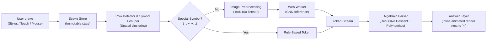

# CalcInk ✍️⚡

> **100% Client-Side, Offline Handwritten Math Calculator**  
> Inter IIT Bootcamp — Software PS

CalcInk is a privacy-first, on-device digital paper notepad that recognizes handwritten mathematical equations and renders evaluated answers inline right next to each row's `=` sign in real time. It requires no backend, no cloud APIs, and zero network connectivity.

---

## 🌟 Key Highlights

- **🔒 100% Offline & Private**: All recognition models and math parsers execute entirely in the browser via dedicated Web Workers. No server calls, no telemetry, no external assets.
- **⚡ 60 FPS Drawing with Zero Lag**: Uses a multi-canvas layer architecture (`live-canvas`, `stroke-canvas`, `answer-canvas`) with requestAnimationFrame batching and pointer event coalescing.
- **🖊️ Tablet & Stylus Native**: Built-in palm rejection, pressure-aware capture, dropped pointer auto-recovery, and long-press/context-menu suppression for Apple Pencil, S-Pen, and Android styluses.
- **📐 Multi-Row Math & Algebra**: Write multiple equations on the page simultaneously. CalcInk clusters strokes into lines, recognizes numbers and operators, evaluates arithmetic (BODMAS), remembers variable assignments (e.g. `x = 5`), and solves linear equations (e.g. `4x = 20`).
- **👀 Live Recognized Tab**: A docked bottom-right pill bar provides real-time token visualization and status feedback for the active row.
- **📜 Premium Digital Paper**: Supports Plain, Ruled, and Dot grid paper types across tailored tone palettes with grain textures.

---

## 🔢 Supported Digits & Operations

CalcInk is trained and optimized to recognize standard handwritten math notation across digits, arithmetic operations, and algebraic variables:

| Category | Supported Symbols | Description & Examples |
| :--- | :--- | :--- |
| **Digits** | `0, 1, 2, 3, 4, 5, 6, 7, 8, 9` | Complete digit set with support for multi-digit integers (e.g., `42`, `108`, `2024`) |
| **Decimals** | `.` | Floating point numbers (e.g., `3.14`, `0.5`, `2.718`) |
| **Basic Arithmetic** | `+` (Addition)<br>`-` (Subtraction) | Supports standard multi-term arithmetic with BODMAS order of operations |
| **Multiplication** | `×`, `*` | Supports explicit multiplication as well as algebraic juxtaposition (e.g., `4x`) |
| **Division** | `÷`, `/` | Division with zero-division safety handling (`DIV_ZERO` $\to$ `Undefined`) |
| **Equals / Trigger** | `=` | Multi-stroke and single-stroke equation delimiter that anchors the inline answer |
| **Variables & Algebra** | `x`, `y`, `z`, `a`, `b`, `c`... | Variable assignment (`x = 10`), expressions with memory (`x + 5 = 15`), and single-variable linear solvers (`3x = 12`) |

---

## 🏗️ Architecture Overview

For the complete in-depth technical documentation across every subsystem, see the [Architecture Document](ARCHITECTURE.md).



### Multi-Layer Canvas Stack
1. **Paper Background (`<div>`)**: CSS-rendered paper tones, grain noise tiles, vignettes, and optional ruled/dot patterns.
2. **Stroke Canvas (`<canvas>`)**: Retains committed strokes rendered via cached `Path2D` paths.
3. **Live Canvas (`<canvas>`)**: Captures active pointer input, tracks coalesced events, and renders smooth current strokes at 60 FPS.
4. **Answer Canvas (`<canvas>`)**: Renders computed answers anchored precisely next to each equation's `=` sign, with smooth entry animations and confidence dots.
5. **Screen Reader Region (`aria-live`)**: Visually hidden announcements for accessibility.

---

## 🛠️ Tech Stack

- **Framework**: [React 18](https://react.dev/) + [Vite](https://vitejs.dev/)
- **Language**: [TypeScript](https://www.typescriptlang.org/) (Strict mode, `noUncheckedIndexedAccess`)
- **ML Engine**: [TensorFlow.js](https://www.tensorflow.org/js) (`@tensorflow/tfjs`) running off-thread in a Web Worker
- **Recognition Model**: [MobileNetV2 CNN](https://github.com/Sagyam/Handwritten-Optical-Character-Recognition) (~2.3M parameters, 100×100×3 RGB, 19 classes)
- **Styling**: Vanilla CSS with curated CSS custom properties (no heavy UI kits)
- **Ink Smoothing**: [`perfect-freehand`](https://github.com/steveruizok/perfect-freehand)
- **Persistence**: IndexedDB ([`idb-keyval`](https://github.com/jakearchibald/idb-keyval))
- **Testing**: [Vitest](https://vitest.dev/) (Unit & integration test suites)
- **Typography**: Bundled local Latin subsets (`@fontsource/inter`, `@fontsource/caveat`)

---

## 🧠 Machine Learning Model

CalcInk performs on-device optical character recognition using an embedded **MobileNetV2 Convolutional Neural Network**:

- **Model Origin**: [Sagyam/Handwritten-Optical-Character-Recognition](https://github.com/Sagyam/Handwritten-Optical-Character-Recognition) by Sagyam Thapa
- **Architecture**: MobileNetV2 backbone with 17 inverted residual blocks and depthwise separable convolutions (~2.3M parameters)
- **Input Tensor**: `[1, 100, 100, 3]` normalized `Float32Array` (100×100 RGB rasterized ink, values `[0.0, 1.0]`)
- **Output Classes (19)**:
  - **Digits (0–9)**: `0, 1, 2, 3, 4, 5, 6, 7, 8, 9`
  - **Operators**: `+` (Add), `-` (Minus), `×` (Multiply), `÷` (Division), `=` (Equals)
  - **Decimal Point**: `.` (Decimal)
  - **Variables**: `x` (X), `y` (Y), `z` (Z)
- **Runtime Environment**: Executed via `@tensorflow/tfjs` in a dedicated Web Worker ([`recognitionWorker.ts`](src/workers/recognitionWorker.ts)) for 60 FPS non-blocking canvas performance.
- **Model License**: **GNU General Public License v3.0 (GPL-3.0)**

### Considered Alternative Models
- **[kimseungdae/ink-on](https://github.com/kimseungdae/ink-on)**: An impressive in-browser implementation of the CoMER (Contextualized Mathematical Expression Recognition) Transformer model via ONNX Runtime Web. While it boasts excellent accuracy for complete equations, we ultimately selected MobileNetV2 for its significantly smaller bundle size (~1.5MB vs 30MB+), faster CPU inference (<5ms), and compatibility with our custom spatial grouping and parsing architecture.
---

## 📁 Project Structure

```
CalcInk/
├── ARCHITECTURE.md           # Comprehensive technical architecture reference
├── docs/                     # Product requirements (PRD) and design specs
├── public/                   # Static models, icons, and textures
├── src/
│   ├── canvas/               # Canvas engine, input handling, DPR scaling, stroke store
│   │   ├── useCanvasInput.ts # Pointer event handlers, palm rejection, auto-recovery
│   │   ├── useCanvasDpr.ts   # Device pixel ratio observer & canvas resizing
│   │   ├── strokeStore.ts    # Framework-agnostic immutable stroke history (undo/redo)
│   │   └── paperTexture.ts   # Digital paper styles (plain, ruled, dot grid)
│   ├── components/           # Toolbar, history buttons, and UI widgets
│   │   ├── RecognitionBar.tsx# Live bottom-right recognized expression inspect tab
│   │   └── Toolbar.tsx       # Tool selection (pen, stroke/pixel eraser, tone popover)
│   ├── overlay/              # Answer rendering engine and inline suggestions
│   │   └── answerRenderer.ts # Anchors text next to '=', animates suggestion write-in
│   ├── parser/               # Math tokenizer, recursive-descent parser & polynomial solver
│   ├── recognition/          # Segmentation, spatial grouping, CNN pipeline
│   │   ├── pipeline.ts       # Orchestrates row detection, worker jobs, and math parsing
│   │   ├── specialSymbols.ts # Fast geometric detection for '=', '÷', and '.'
│   │   ├── rowDetector.ts    # Clusters multi-stroke equations into distinct lines
│   │   └── symbolGrouper.ts  # Groups strokes into individual symbols based on proximity
│   ├── workers/              # Dedicated background Web Worker for ML inference
│   └── contract.ts           # Type contract shared across canvas, recognition & parser
└── vite.config.ts
```

---

## 🚀 Getting Started

### Prerequisites
- [Node.js](https://nodejs.org/) (v18 or higher recommended)
- `npm`

### Installation
```bash
git clone <repository-url>
cd CalcInk
npm install
```

### Development Server
Start the local Vite dev server:
```bash
npm run dev
```
To test on a tablet or mobile device across your local network:
```bash
npm run dev -- --host
```
*(Or forward the port via ngrok: `ngrok http 5173`)*

### Running Tests
Execute the unit test suite with Vitest:
```bash
npm run test -- --run
```

### Production Build
Verify type safety and compile production-ready assets:
```bash
npm run build
```

---

## 📜 License & Compliance

- **Application Code**: Distributed under the [MIT License](LICENSE).
- **Machine Learning Model**: Sourced from [Sagyam/Handwritten-Optical-Character-Recognition](https://github.com/Sagyam/Handwritten-Optical-Character-Recognition) and licensed under the **GNU General Public License v3.0 (GPL-3.0)**.
- **Fonts & Libraries**: All bundled dependencies conform to open-source licenses (MIT / Apache-2.0 / OFL).